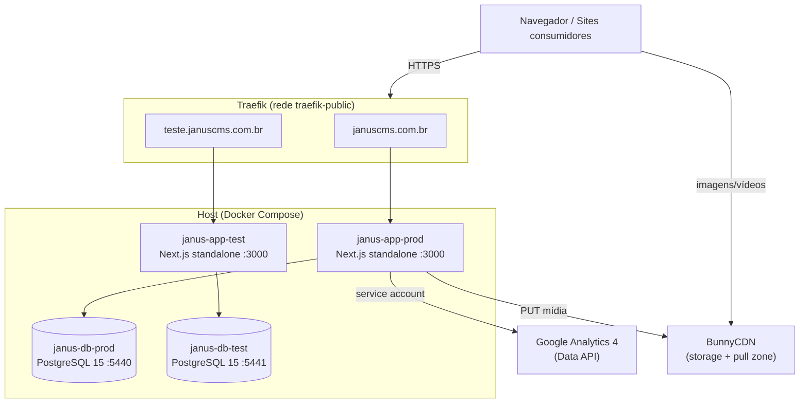
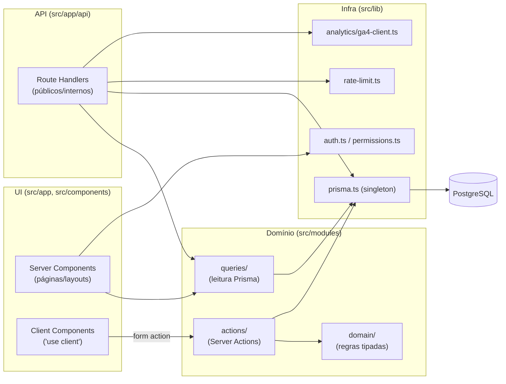

# 01 — Visão Geral

## O que é o Janus

Janus é uma plataforma **multi-tenant** de gestão de sites. Cada **empresa**
(tenant) possui **projetos** do tipo site institucional ou landing page, e cada
projeto contém **páginas** (editadas por um CMS com dois modos) e, opcionalmente,
um **blog** exposto via API pública (headless). A plataforma também oferece
**analytics** (Google Analytics 4), um **modo convidado** para submissão de
conteúdo por terceiros e **backups** automatizados do banco.

O domínio de produção é `januscms.com.br` (ver
[docker-compose.yml](../../docker-compose.yml)).

## Stack verificada

Versões extraídas de [package.json](../../package.json). Gerenciador de pacotes:
**pnpm 10.33.3** (campo `packageManager`).

| Camada | Tecnologia | Versão |
|---|---|---|
| Framework | Next.js (App Router) | `16.2.4` |
| UI runtime | React / React DOM | `19.2.4` |
| Linguagem | TypeScript | `^5` |
| ORM | Prisma (`@prisma/client` + `prisma`) | `^7.8.0` |
| Adapter DB | `@prisma/adapter-pg` + `pg` | `^7.8.0` / `^8.20.0` |
| Banco | PostgreSQL | `15-alpine` (Docker) |
| Validação | Zod | `^4.4.3` |
| Auth | NextAuth | `5.0.0-beta.31` |
| Estilo | Tailwind CSS | `^3.4.17` (+ `@tailwindcss/postcss@^4`) |
| Testes | Vitest + Testing Library | `^4.1.5` |
| Analytics | `@google-analytics/data` | `^6.1.0` |
| Agendamento | `node-cron` | `^4.2.1` |
| Imagens | `sharp` | `^0.34.5` |
| Editores | Monaco, Tiptap | `^4.7.0` / `^3.23.x` |
| UI kit | shadcn/ui, Radix UI, lucide-react | — |

> ⚠️ A confirmar: o arquivo [CLAUDE.md](../../CLAUDE.md) descreve uma stack
> diferente da que está no `package.json` (Prisma 6, Zod 3.24, Tailwind v4,
> Vitest 3). A fonte da verdade aqui é o `package.json`. A divergência está
> registrada em [99-tech-debt.md](99-tech-debt.md).

## Não é um monorepo

Apesar do caminho do repositório conter `MONOREPO/`, **o Janus é uma única
aplicação Next.js**. O arquivo [pnpm-workspace.yaml](../../pnpm-workspace.yaml)
existe, mas declara apenas `ignoredBuiltDependencies` — não há pacotes em
workspace nem múltiplos `package.json`.

## Estrutura de pastas (até 3 níveis)

```
Janus/
├── prisma/
│   ├── schema.prisma              # modelo de dados (PostgreSQL)
│   └── migrations/                # 12 migrations versionadas
├── src/
│   ├── app/                       # App Router: rotas, layouts, route handlers
│   │   ├── (auth)/                # login, no-company, select-company
│   │   ├── [companySlug]/         # área do tenant (dashboard, preview, guest, welcome)
│   │   ├── dashboard-admin/       # painel ADMIN
│   │   ├── dev/[devId]/           # painel DEVELOPER
│   │   ├── first-access/          # reset de senha no primeiro acesso
│   │   └── api/                   # route handlers (públicos e internos)
│   ├── modules/                   # lógica de negócio por domínio (12 módulos)
│   │   └── <dominio>/{domain,actions,queries}/
│   ├── components/                # componentes React (UI, cms, blog, dashboard…)
│   ├── lib/                       # singletons e utilitários (prisma, auth, rate-limit…)
│   ├── hooks/                     # hooks React
│   ├── scripts/                   # CLIs de backup/restore (rodam fora do Next)
│   ├── generated/prisma/          # client Prisma gerado
│   ├── types/                     # tipos (ex.: next-auth.d.ts)
│   └── middleware.ts              # middleware de auth (NextAuth)
├── scripts/                       # utilitários (seed, teste de conexão)
├── .claude/context/              # documentação operacional para agentes
├── docs/                          # esta documentação + docs de API (Postman)
├── docker-compose.yml             # prod + teste (app + Postgres + Traefik)
├── Dockerfile                     # build multi-stage (output standalone)
└── next.config.ts                 # headers de segurança, standalone, imagens
```

A convenção de cada módulo de negócio (em `src/modules/<dominio>/`) é:

- `domain/` — regras de negócio tipadas (presente só onde há lógica acoplada).
- `actions/` — Server Actions (`'use server'`) para mutações.
- `queries/` — leituras diretas via Prisma.

Ver [06-modules.md](06-modules.md) para o detalhamento dos 12 módulos.

## Visão de containers (deploy)



Fontes: [docker-compose.yml](../../docker-compose.yml),
[next.config.ts](../../next.config.ts) (`output: "standalone"`, headers de
segurança), [src/lib/analytics/ga4-client.ts](../../src/lib/analytics/ga4-client.ts),
[src/app/api/upload/route.ts](../../src/app/api/upload/route.ts).

## Camadas lógicas



O fluxo padrão de uma mutação (Server Action) é
**Validação (Zod) → Auth → Prisma → `revalidatePath()`**, conforme
[CLAUDE.md](../../CLAUDE.md). Detalhes em
[02-request-lifecycle.md](02-request-lifecycle.md).
