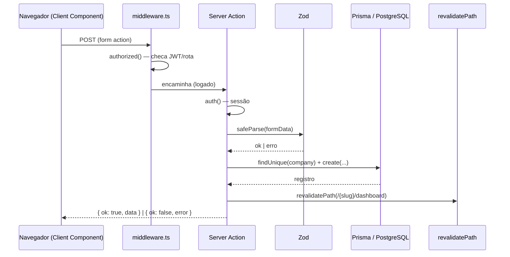
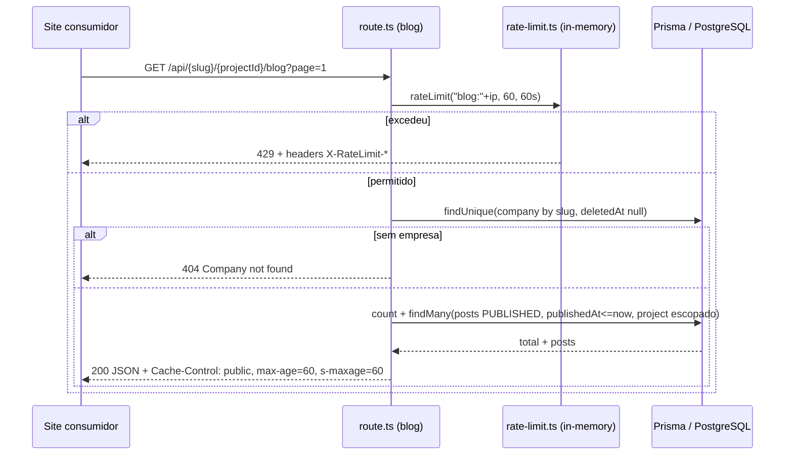

# 02 — Ciclo de Vida de uma Requisição

Este documento descreve como uma requisição percorre o Janus, do middleware até
o banco, tanto para **navegação/dashboard** (Server Components + Server Actions)
quanto para **API pública** (route handlers).

## 1. Middleware (borda)

Toda requisição que não seja asset estático ou rota de API passa pelo middleware
NextAuth em [src/middleware.ts](../../src/middleware.ts):

```ts
export default NextAuth(authConfig).auth
export const config = {
  matcher: ['/((?!api|_next/static|_next/image|favicon.ico|.*\\.png|.*\\.jpg).*)'],
}
```

O `matcher` **exclui `/api`** — portanto os route handlers da API **não passam**
pelo gate de autenticação do middleware; cada um cuida da própria autorização.

A lógica de autorização vive no callback `authorized` de
[src/lib/auth.config.ts](../../src/lib/auth.config.ts), que decide redirecionos
por papel e por rota. Resumo:

| Rota | Regra |
|---|---|
| `/` | Redireciona conforme papel: DEVELOPER→`/dev/{id}/dashboard`, ADMIN→`/dashboard-admin`, sem empresa→`/no-company`, demais→`/{slug}/dashboard` |
| `/dashboard-admin/*` | Exige papel `ADMIN` (senão `/login`) |
| `/dev/{userId}/dashboard` | Exige `DEVELOPER` ou `ADMIN`; DEVELOPER só acessa o próprio `userId` |
| `/{slug}/dashboard*` | Exige login; se não logado, redireciona para `/{slug}/welcome`. **Acesso real à empresa é validado no layout** (consulta o banco) |
| `/first-access`, `/no-company`, `/select-company` | Apenas exigem login |

> Observação: o middleware aprova rotas de dashboard só com base no JWT. A
> verdadeira checagem de pertencimento à empresa acontece no layout do tenant
> (ver [03-multi-tenancy.md](03-multi-tenancy.md)).

## 2. Sessão e JWT

A sessão é **JWT** (`session.strategy = 'jwt'`). Os callbacks `jwt` e `session`
em [src/lib/auth.config.ts](../../src/lib/auth.config.ts) propagam para a sessão:
`id`, `role`, `permissions`, `image` e `companySlug`. O provider de credenciais e
o bloqueio de IP estão em [src/lib/auth.ts](../../src/lib/auth.ts) — detalhado em
[04-auth-and-permissions.md](04-auth-and-permissions.md).

## 3. Renderização (Server Components)

As páginas em `src/app/**/page.tsx` são, por padrão, **Server Components**. Elas:

1. Obtêm a sessão com `await auth()`.
2. Validam o tenant no layout (`[companySlug]/dashboard/layout.tsx`).
3. Leem dados chamando funções de `src/modules/<dominio>/queries/` (Prisma
   direto) ou `db` diretamente.

`'use client'` é usado só quando há estado/efeito/interação (ex.: editores do
CMS, banners de impersonation).

## 4. Mutações (Server Actions)

As mutações são **Server Actions** (`'use server'`) em
`src/modules/<dominio>/actions/`. O padrão prescrito em
[CLAUDE.md](../../CLAUDE.md) é:

> **Validação (Zod) → Checagem de Auth → Execução no Prisma → `revalidatePath()`**

com retorno padronizado `{ ok: true, data }` ou `{ ok: false, error, code? }`.

Exemplo representativo —
[createBlogPost.ts](../../src/modules/blog/actions/createBlogPost.ts), que também
ilustra a assinatura `(prevState, formData)` consumida pelo hook
`useActionState` do React 19:

```ts
export async function createBlogPost(_: unknown, formData: FormData) {
  const session = await auth()                       // 1. Auth
  if (!session?.user?.id) return { ok: false, error: 'Não autenticado' }

  const parsed = schema.safeParse({ /* ...formData */ })   // 2. Validação Zod
  if (!parsed.success) return { ok: false, error: 'Dados inválidos' }

  // 3. Escopo de tenant + Prisma
  const company = await db.company.findUnique({ where: { slug: companySlug, deletedAt: null } })
  // ...checa acesso, cria post...

  revalidatePath(`/${companySlug}/dashboard`)        // 4. Revalidação
  revalidateSites(companySlug)
  return { ok: true, data: post }
}
```

> ⚠️ A confirmar: nem toda action segue o padrão à risca. Por exemplo,
> [createProject.ts](../../src/modules/projects/actions/createProject.ts) **não
> usa Zod** e **não chama `revalidatePath()`**. Ver
> [99-tech-debt.md](99-tech-debt.md).

### Sequência: submissão de formulário (dashboard)



## 5. API pública (route handlers)

Os endpoints em `src/app/api/**/route.ts` **não passam pelo middleware**. Cada um
aplica seu próprio controle. Os endpoints públicos de leitura (blog, conteúdo de
página) seguem o pipeline:

**Rate-limit por IP → CORS → resolução de tenant (companySlug) → query escopada →
cache HTTP**.

### Sequência: requisição ao blog público



Fonte:
[src/app/api/[companySlug]/[projectId]/blog/route.ts](../../src/app/api/[companySlug]/[projectId]/blog/route.ts),
[src/lib/rate-limit.ts](../../src/lib/rate-limit.ts). Contratos completos em
[07-public-api.md](07-public-api.md).

## 6. Acesso ao banco

Todo acesso usa o **singleton** `db` de [src/lib/prisma.ts](../../src/lib/prisma.ts),
um `PrismaClient` com adapter `@prisma/adapter-pg` sobre um `Pool` do `pg`. Em
desenvolvimento, a instância é guardada em `globalThis` para sobreviver ao
hot-reload. O client gerado fica em `src/generated/prisma` (saída customizada do
generator no schema).
