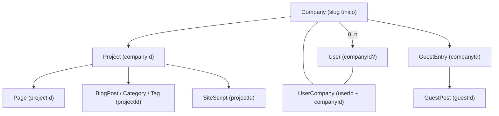
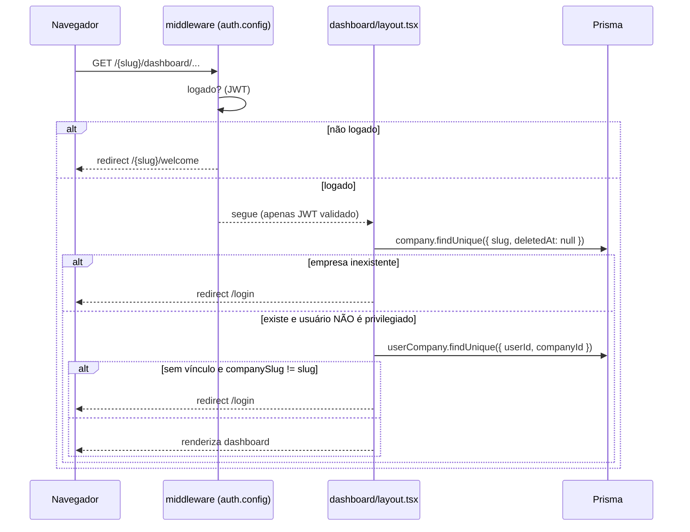

# 03 — Multi-tenancy

A multi-tenancy é o conceito central do Janus. Este documento descreve como os
tenants são modelados, como são resolvidos a partir da URL e como o isolamento é
(ou não é) garantido nas consultas.

## Estratégia: banco compartilhado com colunas de tenant

Não há schema-per-tenant nem banco-per-tenant. Todos os tenants compartilham o
mesmo banco PostgreSQL e a separação é feita por **colunas de proprietário**:

- **`Company`** é a raiz do tenant (identificada por `slug` único).
- **`Project`** pertence a uma empresa via `companyId`.
- **`Page`, `BlogPost`, `BlogCategory`, `BlogTag`, `SiteScript`** pertencem a um
  projeto via `projectId`.
- **`GuestEntry`** pertence a uma empresa via `companyId`; **`GuestPost`** pende
  de um `GuestEntry` via `guestId`.



Fonte: [prisma/schema.prisma](../../prisma/schema.prisma). Detalhes dos campos em
[05-data-model.md](05-data-model.md).

## Relação usuário ↔ empresa

Existem **dois** mecanismos de associação de usuário a empresa:

1. **`User.companyId`** (nullable) — a empresa "principal" do usuário. É a que
   alimenta `companySlug` no JWT (ver [src/lib/auth.ts](../../src/lib/auth.ts),
   onde DEVELOPER fica sem `companySlug`).
2. **`UserCompany`** — tabela de junção (`@@unique([userId, companyId])`) que
   permite um usuário pertencer a **várias** empresas, cada associação com suas
   próprias `permissions`.

No dashboard, quando o usuário pertence a mais de uma empresa, um
`CompanySwitcher` é exibido (ver
[layout.tsx](../../src/app/[companySlug]/dashboard/layout.tsx), uso de
`getUserCompanies`).

## Resolução de tenant a partir da URL

O `slug` da empresa é o **primeiro segmento** da rota do tenant:

```
/{companySlug}/dashboard/sites/{siteId}/blog/posts
/{companySlug}/dashboard/landing-pages/{lpId}/pages/{pageId}/builder
/{companySlug}/preview/{pageId}
```

- `{siteId}` e `{lpId}` são `Project.id` (projetos do tipo `INSTITUTIONAL` e
  `LANDING_PAGE`, respectivamente).
- `{pageId}` é `Page.id`.

### Validação em duas etapas



A regra de acesso (de
[layout.tsx](../../src/app/[companySlug]/dashboard/layout.tsx)) para usuários
**não privilegiados** é:

```ts
const hasAccess =
  session.user.companySlug === companySlug ||
  !!(await db.userCompany.findUnique({
    where: { userId_companyId: { userId: session.user.id, companyId: company.id } },
  }))
if (!hasAccess) redirect("/login")
```

Usuários **privilegiados** (`ADMIN`/`DEVELOPER`, via `isPrivilegedRole`) pulam
essa checagem e podem acessar qualquer empresa — é o que habilita o painel de
impersonation (ver [04-auth-and-permissions.md](04-auth-and-permissions.md)).

## Isolamento nas consultas

O isolamento depende de **cada query incluir o filtro de tenant explicitamente**
— não há middleware de Prisma nem RLS no banco que force isso automaticamente.

Padrões observados:

- **Server Actions** resolvem a empresa pelo `companySlug` recebido e conferem
  `session.user.companySlug` antes de mutar (ex.:
  [createBlogPost.ts](../../src/modules/blog/actions/createBlogPost.ts),
  [createProject.ts](../../src/modules/projects/actions/createProject.ts)).
- **API pública** resolve a empresa por `slug` e escopa a query pelo
  `company.id` e pelo `projectId` da URL — ex. o `where` do blog:

  ```ts
  const where = {
    projectId,
    status: 'PUBLISHED',
    publishedAt: { not: null, lte: new Date() },
    project: { companyId: company.id, blogEnabled: true, isActive: true, deletedAt: null },
  }
  ```

  (de
  [blog/route.ts](../../src/app/api/[companySlug]/[projectId]/blog/route.ts))

> ⚠️ A confirmar: como o isolamento é manual, qualquer query que esqueça o filtro
> de `companyId`/`projectId` vaza dados entre tenants. Notei também duas rotas de
> blog público — uma escopada por `projectId` e outra **apenas** por
> `companySlug` (sem `projectId`) — registradas em
> [99-tech-debt.md](99-tech-debt.md) e [07-public-api.md](07-public-api.md).

## Soft delete e tenancy

As entidades de tenant que suportam soft delete (`Company`, `User`, `Project`,
`Page`) devem ser filtradas por `deletedAt: null`, conforme
[CLAUDE.md](../../CLAUDE.md). As consultas de resolução de empresa já o fazem
(`where: { slug, deletedAt: null }`). O **blog não tem soft delete** (exclusão é
permanente) — ver [05-data-model.md](05-data-model.md).
