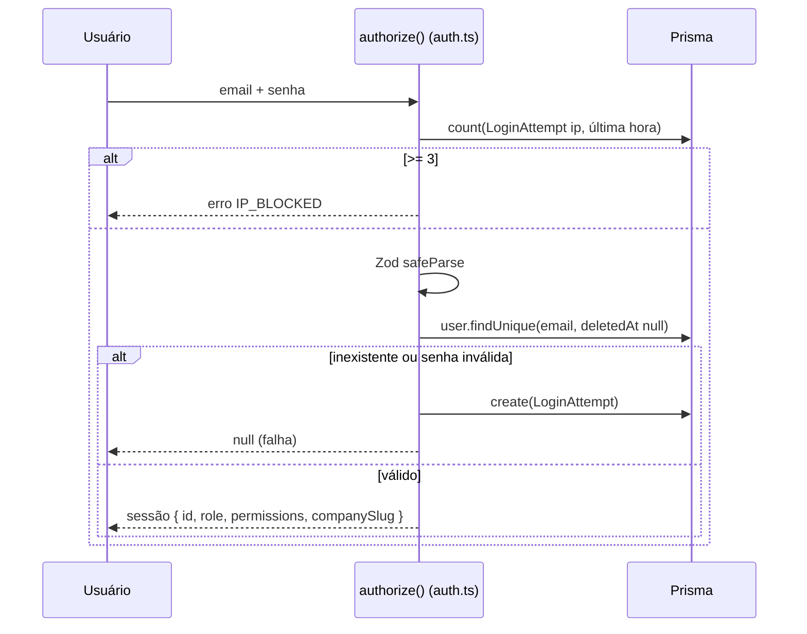
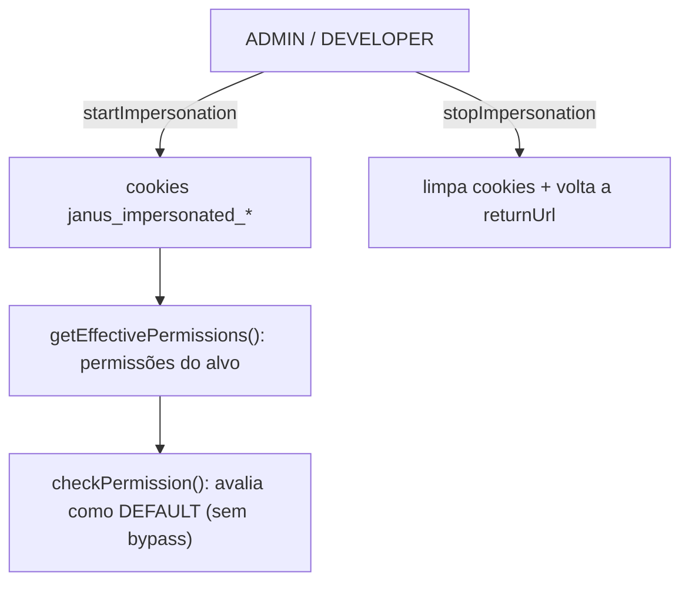

# 04 — Autenticação e Permissões

## Visão geral

A autenticação usa **NextAuth `5.0.0-beta.31`** com provider de **credenciais**
(e-mail/senha), sessão **JWT** e senhas com **bcryptjs**. A autorização combina
**papéis** (`UserRole`) com um sistema de **permissões granulares** armazenado em
`User.permissions`. Há ainda **impersonation** (usuários privilegiados agindo
como outro usuário) e **bloqueio de IP** por tentativas de login.

Arquivos centrais:

- [src/lib/auth.ts](../../src/lib/auth.ts) — provider, `authorize`, bloqueio de IP.
- [src/lib/auth.config.ts](../../src/lib/auth.config.ts) — `pages`, callbacks
  `authorized`/`jwt`/`session` (compartilhado com o middleware).
- [src/middleware.ts](../../src/middleware.ts) — aplica `authConfig` na borda.
- [src/lib/auth/permissions.ts](../../src/lib/auth/permissions.ts) — permissões e
  impersonation.

## Login (provider de credenciais)

Em [src/lib/auth.ts](../../src/lib/auth.ts), o `authorize`:

1. Resolve o IP do cliente (`x-forwarded-for` → `x-real-ip` → `"unknown"`).
2. **Bloqueia** se houver ≥ 3 `LoginAttempt` daquele IP na última hora
   (`throw new Error("IP_BLOCKED")`).
3. Valida as credenciais com Zod (`email`, `password`).
4. Busca o usuário por e-mail com `deletedAt: null` e compara a senha com
   `bcryptjs.compare`.
5. Em falha (parse, usuário inexistente ou senha inválida) **registra um
   `LoginAttempt`** e retorna `null`.
6. Em sucesso, retorna `{ id, email, role, permissions, image, companySlug }` —
   onde `companySlug` fica **`undefined` para DEVELOPER**.



> Nota: o `count`/`create` de `LoginAttempt` toleram a tabela ainda não existir
> (tratam `P2021`/"does not exist" como "não bloqueado"). Ver
> [src/lib/auth.ts](../../src/lib/auth.ts).

## JWT e sessão

Os callbacks em [src/lib/auth.config.ts](../../src/lib/auth.config.ts) gravam no
token e expõem na sessão: `id`, `role`, `permissions`, `image`, `companySlug`. O
callback `jwt` também aceita `trigger === 'update'` para **atualizar
`permissions` em tempo real** (`session.permissions`), usado quando um admin
altera permissões de um usuário.

## Papéis (`UserRole`)

Enum em [prisma/schema.prisma](../../prisma/schema.prisma):

| Papel | Capacidades |
|---|---|
| `ADMIN` | Acesso total; `/dashboard-admin`; ignora checagem de empresa; pode impersonar |
| `DEVELOPER` | Painel próprio em `/dev/{userId}/dashboard`; sem `companySlug`; privilegiado |
| `DEFAULT` | Usuário comum, escopado à(s) empresa(s) à qual pertence |

`isPrivilegedRole(role)` retorna `true` para `ADMIN` ou `DEVELOPER`
([permissions.ts](../../src/lib/auth/permissions.ts)). Papéis privilegiados
**ignoram** todas as checagens de permissão e de pertencimento à empresa.

O roteamento por papel é decidido no callback `authorized` — ver a tabela em
[02-request-lifecycle.md](02-request-lifecycle.md#1-middleware-borda).

## Permissões granulares

Definidas em [src/lib/auth/permissions.ts](../../src/lib/auth/permissions.ts).

### Constantes (`PERMISSIONS`)

`PROJECT_CREATE`, `PROJECT_EDIT`, `PROJECT_DELETE`, `PAGE_CREATE`, `PAGE_DELETE`,
`PAGE_BUILD`, `BLOG_MANAGE`, `GUEST_MANAGE`, `TEAM_MANAGE`.

### Estrutura normalizada

As permissões são normalizadas para a forma:

```
{
  sites:        { project: PermissionName[], page: PermissionName[] },
  landingPages: { project: PermissionName[], page: PermissionName[] }
}
```

ou seja, **módulo** (`sites` | `landingPages`) × **tier** (`project` | `page`).

`normalizePermissions()` aceita três formatos de entrada (compatibilidade):

1. **Objeto JSON** já no formato normalizado (ou string JSON começando com `{`).
2. **Array de strings com prefixo**: `sites:project:PROJECT_CREATE`,
   `landingPages:page:BLOG_MANAGE`, etc. (prefixos parciais como `sites:` caem em
   `page`).
3. **Array plano legado**: `['PROJECT_CREATE', 'BLOG_MANAGE']` — aplicado ao tier
   `page` de **ambos** os módulos.

### Checagem

- `hasPermission(session, permission, module='sites', tier='page', impersonating=false)`
  — síncrona. Se `impersonating` for `false` e o papel for `ADMIN`/`DEVELOPER`,
  retorna `true` (bypass). Caso contrário, verifica a lista do `module`/`tier`.
- `checkPermission(session, permission, module, tier)` — assíncrona; detecta
  impersonation e, nesse caso, avalia com as **permissões do usuário
  impersonado** (papel tratado como `DEFAULT`, sem bypass).

## Impersonation

Usuários privilegiados podem "entrar" como outro usuário para validar fluxos. O
estado é mantido em **cookies** (constantes em
[permissions.ts](../../src/lib/auth/permissions.ts)):

- `janus_impersonated_user_id`
- `janus_impersonated_user_name`
- `janus_impersonation_return_url`

Helpers: `isImpersonating()`, `getImpersonatedUserId()`,
`getImpersonatedUserName()`, `getImpersonationReturnUrl()`,
`getEffectivePermissions(realUserId)` (resolve permissões do alvo quando
impersonando). As actions ficam em
[src/modules/auth/actions/](../../src/modules/auth/actions/)
(`startImpersonation`, `stopImpersonation`, `enterPrivilegedMode`,
`setReturnUrl`).

No dashboard, o `ImpersonationBanner` é renderizado **somente para usuários
privilegiados** e permite trocar de empresa/usuário (ver
[layout.tsx](../../src/app/[companySlug]/dashboard/layout.tsx)).



## Bloqueio de IP

Modelo `LoginAttempt` (`ip`, `email?`, `createdAt`) em
[prisma/schema.prisma](../../prisma/schema.prisma). Regra: **≥ 3 tentativas
falhas por IP em 1 hora** bloqueiam novos logins daquele IP. O painel admin
expõe IPs bloqueados e desbloqueio (`getBlockedIps`, `unblockIp` em
[src/modules/admin/](../../src/modules/admin/)).

> ⚠️ A confirmar: não há rotina de expurgo de `LoginAttempt`; a tabela cresce
> indefinidamente. Registrado em [99-tech-debt.md](99-tech-debt.md).
