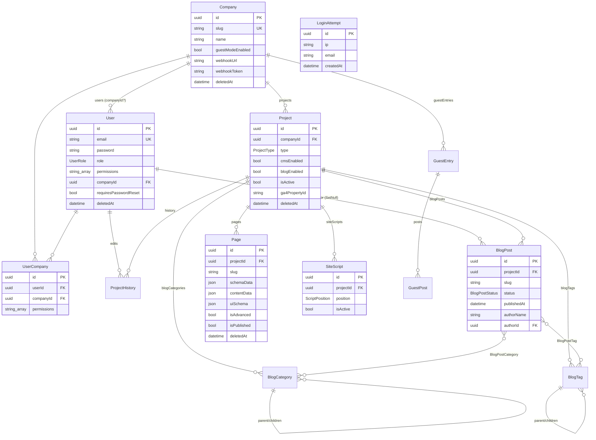

# 05 — Modelo de Dados

Fonte única: [prisma/schema.prisma](../../prisma/schema.prisma). Provider
PostgreSQL; client gerado em `src/generated/prisma` via generator
`prisma-client` (`engineType = "library"`). Chaves primárias são `uuid` (`@db.Uuid`).

## Enums

| Enum | Valores |
|---|---|
| `UserRole` | `ADMIN`, `DEFAULT`, `DEVELOPER` |
| `ProjectType` | `LANDING_PAGE`, `INSTITUTIONAL` |
| `BlogPostStatus` | `DRAFT`, `PUBLISHED` |
| `ScriptPosition` | `HEAD`, `BODY_END` |

`GuestPost.mediaType` é uma **string** com default `"IMAGE"` (não é enum).

## Diagrama ER

> Nota: `LoginAttempt` não tem relações — é uma tabela de auditoria/segurança
> isolada. Aparece no diagrama sem arestas.

## Entidades principais

### Company (raiz do tenant)
`id`, `slug` (único), `name`, `description?`, `logo?`, `guestModeEnabled`,
`webhookUrl?`, `webhookToken?`, `createdById?`, timestamps, **`deletedAt?`**
(soft delete). Relações: `users`, `projects`, `guestEntries`, `userCompanies`.

### User
`email` (único), `password` (hash), `name?`, `phone?`, `role`,
`permissions: String[]`, `image?`, `preferences: Json`, `requiresPasswordReset`,
`companyId?` (`onDelete: SetNull`), **`deletedAt?`**. Relações: `projectHistories`,
`blogPosts` (como autor), `companies` (`UserCompany`).

### UserCompany (junção N:N)
`userId` + `companyId` com `@@unique([userId, companyId])` e `permissions`
próprias por vínculo. Ambas as FKs com `onDelete: Cascade`. Habilita o usuário
multi-empresa — ver [03-multi-tenancy.md](03-multi-tenancy.md).

### Project
`companyId` (`onDelete: Cascade`), `name`, `type` (`ProjectType`), `previewUrl?`,
`cmsSyncScriptUrl?`, `cmsEnabled`, `ga4PropertyId?`, `isActive`, `blogEnabled`,
`deletedBy?`, `deletionReason?`, timestamps, **`deletedAt?`**. Agrega `pages`,
`blogPosts`, `blogCategories`, `blogTags`, `siteScripts`, `projectHistories`.

### Page
`projectId` (`onDelete: Cascade`), `name`, `slug`, `content: Json`,
`schemaData: Json`, `contentData: Json`, `previewUrl?`, `isPublished`,
**`isAdvanced`** (alterna CMS legacy × avançado), `uiSchema: Json`, timestamps,
**`deletedAt?`**. Único por `@@unique([projectId, slug])`. O campo `isAdvanced`
governa o modo do CMS — ver `.claude/context/cms/`.

### Blog (BlogPost, BlogCategory, BlogTag)
Todos escopados por `projectId` (`onDelete: Cascade`) e **sem `deletedAt`**
(exclusão é física/hard delete).

- **BlogPost**: `slug?`, `title`, `subtitle?`, `status` (default `PUBLISHED`),
  `publishedAt?`, `body` (Text), `coverImageUrl?`, `authorName`, `authorId?`
  (`onDelete: SetNull`), `readingTime?`, campos SEO. N:N com categorias e tags
  via `BlogPostCategory`/`BlogPostTag`. `@@unique([projectId, slug])`.
- **BlogCategory** e **BlogTag**: `name`, `slug`, SEO, `isActive`, e
  **hierarquia** via `parentId` (auto-relação `SubCategories`/`SubTags`).
  `@@unique([projectId, slug])`.

### SiteScript
Injeção de código por projeto: `name`, `code` (Text), `position`
(`HEAD`|`BODY_END`), `isActive`, `projectId` (`onDelete: Cascade`).

### Guest (GuestEntry, GuestPost)
- **GuestEntry**: `name`, `email`, `companyId` (`onDelete: Cascade`),
  `@@unique([email, companyId])`. Representa um convidado por empresa.
- **GuestPost**: `title?`, `message` (Text), `imageUrl`, `mediaType`
  (default `"IMAGE"`), `guestId` (`onDelete: Cascade`).

### ProjectHistory (auditoria)
`projectId` + `userId` (ambos `onDelete: Cascade`), `previousState: Json?`,
`newState: Json?`, `version: Int`. Trilha de versões de edição de projeto/página.

### LoginAttempt (segurança)
`ip` (indexado), `email?`, `createdAt`. Base do bloqueio de IP — ver
[04-auth-and-permissions.md](04-auth-and-permissions.md).

## Soft delete vs hard delete

| Tem `deletedAt` (soft delete) | Sem `deletedAt` (hard delete) |
|---|---|
| Company, User, Project, Page | UserCompany, BlogPost, BlogCategory, BlogTag, SiteScript, GuestEntry, GuestPost, ProjectHistory, LoginAttempt |

Conforme [CLAUDE.md](../../CLAUDE.md), entidades com soft delete devem sempre ser
consultadas com `deletedAt: null`. As entidades sem `deletedAt` são removidas
fisicamente (e em cascata, conforme as FKs acima).

## Migrations

12 migrations versionadas em
[prisma/migrations/](../../prisma/migrations/), incluindo a introdução da
arquitetura multi-tenant, `isPublished`/`isAdvanced` em páginas e `mediaType` em
guest posts. O comando de desenvolvimento é `pnpm db:migrate`
(`prisma migrate dev`).
