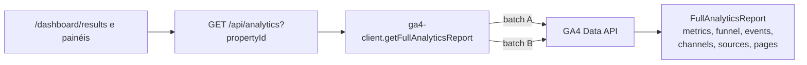
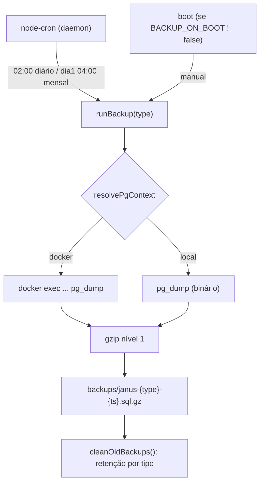
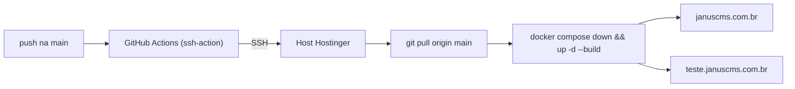

# 08 — Integrações, Jobs e Operação

## Integrações externas

### Google Analytics 4 (GA4)

Cliente em [src/lib/analytics/ga4-client.ts](../../src/lib/analytics/ga4-client.ts),
usando `@google-analytics/data` (`BetaAnalyticsDataClient`). Autenticação por
**service account** lida do ambiente:

| Variável | Uso |
|---|---|
| `GA4_CLIENT_EMAIL` | E-mail da service account |
| `GA4_PRIVATE_KEY` | Chave privada (`\n` escapados, convertidos em runtime) |
| `GA4_PROJECT_ID` | Projeto GCP |

O client é **memoizado** (`cachedClient`). A função `getFullAnalyticsReport(propertyId)`
monta 7 relatórios e os busca em **2 round-trips** via `batchRunReports`
(`Promise.all` de dois batches):

- **Batch A**: série diária (30d), funil (7d atual vs 7d anterior), eventos (7d),
  canais (30d), fontes (30d).
- **Batch B**: top páginas (30d).

O `propertyId` por projeto vem de `Project.ga4PropertyId`
([schema](../../prisma/schema.prisma)); o endpoint `GET /api/analytics` exige
sessão e retorna `502` em erro do GA4 (ver
[07-public-api.md](07-public-api.md)). Consultas agregadas por empresa ficam em
[src/modules/analytics/](../../src/modules/analytics/). Documentação operacional:
[`.claude/context/analytics/`](../../.claude/context/analytics/).

### BunnyCDN (storage + CDN de mídia)

Upload em [src/app/api/upload/route.ts](../../src/app/api/upload/route.ts).
Autoriza por **sessão** ou **cookie `guest_entry_id`** válido. Limites:

| Tipo | MIME aceitos | Tamanho máx. |
|---|---|---|
| Imagem | jpeg, png, webp, avif, gif, heic, heif | **10 MB** |
| Vídeo | mp4, quicktime, webm | **200 MB** |

O arquivo é enviado via `PUT https://{BUNNY_HOST}/{BUNNY_STORAGE_ZONE}/guest-posts/{nome}`
(header `AccessKey`), com timeout de 300s, e a URL pública retornada é
`https://{BUNNY_PULL_ZONE}/guest-posts/{nome}`. Variáveis: `BUNNY_HOST`,
`BUNNY_STORAGE_ZONE`, `BUNNY_ACCESS_KEY`, `BUNNY_PULL_ZONE`.

> Nota: o nome é gerado com `uid-{Date.now()}-{crypto.randomUUID()}.{ext}`; todos
> os uploads caem no prefixo `guest-posts/`. A mensagem de erro de `AbortError`
> menciona ">30s" embora o timeout configurado seja de **300s** — registrado em
> [99-tech-debt.md](99-tech-debt.md).

### PostgreSQL

Acesso via singleton [src/lib/prisma.ts](../../src/lib/prisma.ts)
(`PrismaClient` + `@prisma/adapter-pg` sobre `pg.Pool`, `connectionString =
DATABASE_URL`). Modelo de dados em [05-data-model.md](05-data-model.md).

## Cache e rate-limit

Não há Redis nem fila externa. Os mecanismos são:

- **Rate-limit in-memory** ([src/lib/rate-limit.ts](../../src/lib/rate-limit.ts)):
  `Map` de buckets `{ count, resetAt }` por chave, com `sweep()` a cada 60s. É
  **por processo** — não compartilhado entre réplicas.
- **Cache HTTP** nos endpoints públicos (`Cache-Control: public, max-age=60,
  s-maxage=60`; scripts usam `s-maxage=60, stale-while-revalidate=300`).
- **Revalidação do Next** (`revalidatePath()` e `revalidateSites()`) após
  mutações em Server Actions — ver [02-request-lifecycle.md](02-request-lifecycle.md).

> ⚠️ A confirmar: por serem em memória, rate-limit e qualquer estado de processo
> não funcionam corretamente com múltiplas instâncias da app. Hoje o
> `docker-compose.yml` roda uma instância por ambiente. Registrado em
> [99-tech-debt.md](99-tech-debt.md).

## Jobs e backups

Não há job queue. O único processo recorrente é o **daemon de backup**, que roda
**fora do Next.js** via `tsx`:

| Comando | Script | Função |
|---|---|---|
| `pnpm backup:daemon` | [src/scripts/backup-daemon.ts](../../src/scripts/backup-daemon.ts) | Agenda backups com `node-cron` (não encerra) |
| `pnpm backup:now` | [src/scripts/backup.ts](../../src/scripts/backup.ts) | Backup manual único |
| `pnpm db:restore` | [src/scripts/restore.ts](../../src/scripts/restore.ts) | Restauração a partir de um arquivo |

O daemon ([backup-daemon.ts](../../src/scripts/backup-daemon.ts)):

- No boot, executa um backup `manual` (a menos que `BACKUP_ON_BOOT=false`).
- Agenda **diário às 02:00** (`0 2 * * *`, retém 3) e **mensal no dia 1 às 04:00**
  (`0 4 1 * *`, retém 3); backups `manual` retêm 10.
- `cleanOldBackups()` remove os excedentes por tipo no diretório `backups/`.

O backup em si ([backup.ts](../../src/scripts/backup.ts)) executa `pg_dump`
(`--format=plain`) com saída comprimida em `.sql.gz` (gzip nível 1), injetando
`PGPASSWORD` apenas no env do processo-filho. Suporta dois modos via
`resolvePgContext` (de `pg-bin`): binário local ou `docker exec` no container do
Postgres (com `nice`/`ionice` para baixa prioridade).

Documentação operacional: [`.claude/context/backup/`](../../.claude/context/backup/).

## Deploy

- **Imagem**: [Dockerfile](../../Dockerfile) multi-stage (`deps → builder →
  runner`), `prisma generate` antes do `next build`, saída `standalone`
  ([next.config.ts](../../next.config.ts)), usuário não-root, healthcheck em
  `/login`.
- **Orquestração**: [docker-compose.yml](../../docker-compose.yml) sobe app +
  Postgres 15 para **prod** (`januscms.com.br`, DB na porta 5440) e **teste**
  (`teste.januscms.com.br`, DB na 5441), atrás do **Traefik** (rede
  `traefik-public`, TLS via `certresolver=myresolver`).
- **CI/CD**: [.github/workflows/deploy.yml](../../.github/workflows/deploy.yml) —
  em `push` na `main`, conecta por SSH no host (Hostinger), faz `git pull` e
  `docker compose up -d --build`.

## Headers de segurança

Definidos globalmente em [next.config.ts](../../next.config.ts) para todas as
rotas: `X-Frame-Options: SAMEORIGIN`, `X-Content-Type-Options: nosniff`,
`Referrer-Policy: strict-origin-when-cross-origin`, `X-DNS-Prefetch-Control: on`,
`Strict-Transport-Security` (2 anos, `includeSubDomains; preload`) e
`Permissions-Policy` desabilitando câmera/microfone/geolocalização/interest-cohort.
Server Actions têm `bodySizeLimit: '10mb'`. As imagens permitem
`remotePatterns` com `hostname: '**'` (qualquer host HTTPS) — ver
[99-tech-debt.md](99-tech-debt.md).
